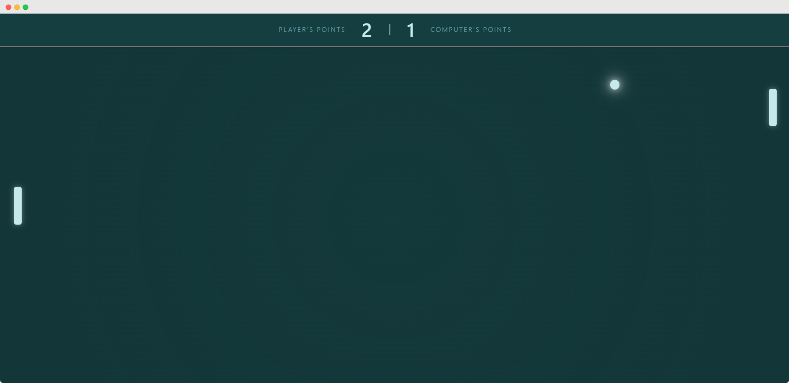

# 🏓 Web Pong Game

[](https://developer.mozilla.org/en-US/docs/Web/JavaScript)  
[](https://developer.mozilla.org/en-US/docs/Web/CSS)  
[](https://developer.mozilla.org/en-US/docs/Web/HTML)  

---

## Descrição

Web Pong é uma implementação moderna do clássico jogo Pong usando tecnologias web nativas: JavaScript, CSS e HTML.  
Ele oferece controles via mouse, teclado (W/S) e suporte a toque (touchscreen), além de um visual estilizado com efeitos de luz na bola e animação suave.

O projeto tem como objetivo ser leve, responsivo e fácil de entender, servindo tanto para aprendizado quanto diversão rápida.

---

## Funcionalidades

- Controles:
  - Mouse (movimento vertical)
  - Teclado (W/S para mover o paddle do jogador)
  - Touchscreen (arraste vertical em dispositivos móveis)
- Inteligência artificial simples para o paddle do computador
- Sistema de pontuação com animação visual ao marcar ponto
- Visual moderno com efeitos de luz e cores dinâmicas
- Design responsivo que adapta-se à tela do usuário

---

## Como usar

1. Clone este repositório:
   ```bash
   git clone https://github.com/seu-usuario/web-pong.git
   ```
2. Abra o arquivo `index.html` em seu navegador moderno (Chrome, Firefox, Edge, Safari).
3. Use o mouse para mover seu paddle verticalmente, ou as teclas **W** e **S** para controlar via teclado.
4. Em dispositivos móveis, use o toque para movimentar o paddle.
5. Divirta-se!

---

## Estrutura do projeto

```
/images
  └── demo.png          # Imagem demo do jogo
/scripts
  ├── ball.js           # Lógica da bola
  ├── paddle.js         # Lógica dos paddles
  └── script.js         # Loop principal e controle de input
/styles
  └── style.css         # Estilos do jogo
index.html              # Página principal do jogo
README.md               # Este arquivo
```

---

## Demo do Jogo



---

## Tecnologias utilizadas

- JavaScript (ES6 Modules)
- CSS3 (Custom Properties, Flexbox)
- HTML5

---

## Licença

Este projeto é aberto e livre para uso, modificação e distribuição.

---

> Desenvolvido com ❤️ por Gustavo Almeida
